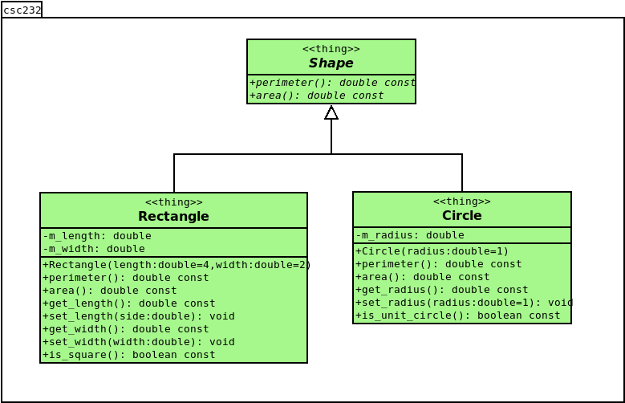

# HW01 - C++ Classes

This assignment explores classes in C++, as well as a common relationship between classes, namely, inheritance.

In particular, this assignment has the student realize the following shape hierarchy.



#### Figure 1: Shapes class inheritance hierarchy

## Background

Before proceeding with this lab, the student should take the time to read

* [Appendix A Review of C++ Fundamentals](https://msu.vitalsource.com/reader/books/9780138122782/epubcfi/6/574%5B%3Bvnd.vst.idref%3DP7001018341000000000000000006D88%5D!/4/2%5BP7001018341000000000000000006D88%5D/2/2%5BP7001018341000000000000000006D89%5D/7:7%5Biew%2C%20of%5D)
* [Appendix C C++ Documentation Systems](https://msu.vitalsource.com/reader/books/9780138122782/epubcfi/6/608%5B%3Bvnd.vst.idref%3DP70010183410000000000000000076A5%5D!/4/2%5BP70010183410000000000000000076A5%5D/2/2%5BP70010183410000000000000000076A6%5D/7:5%5B%2B%20D%2Cocu%5D)
* [Chapter 1 Data Abstraction: The Walls](https://msu.vitalsource.com/reader/books/9780138122782/epubcfi/6/30%5B%3Bvnd.vst.idref%3DP7001018341000000000000000000784%5D!/4/2%5BP7001018341000000000000000000784%5D/2/2%5BP7001018341000000000000000000785%5D/7:0%5B%2C%20Da%5D)
* [C++ Interlude 1 C++ Classes](https://msu.vitalsource.com/reader/books/9780138122782/epubcfi/6/46%5B%3Bvnd.vst.idref%3DP70010183410000000000000000009FA%5D!/4/2%5BP70010183410000000000000000009FA%5D/2/2%5BP70010183410000000000000000009FB%5D/7:0%5B%2C%20C%2B%5D)

## Objective

Upon successful completion of this lab, the student has learned how to

* declare classes in C++
* separate class specification from implementation through the use of header files and source files
* realize a simple inheritance hierarchy

## Getting Started

After accepting this assignment with the provided GitHub Classroom Assignment link, decide how you want to work with
your newly created repository:

* Using Codespaces directly in your web browser that employees the Visual Studio Code online IDE, or
* Using the IDE of your choice on your local machine

### Codespaces

If a Codespace is available for use (and this is your preferred method of development), open your newly created
repository in a Codespace.

At this point, you can skip to [Creating a development branch](#creating-a-development-branch).

### Local Development

Depending upon the IDE of your choice, many of the following steps may be taken within your IDE. It is up to you to
discover these tools (assuming they're available) and learn how to use them appropriately as desired. The following
instructions are assumed to take place within a terminal window. Note: many IDEs provide a terminal window as well.

#### Cloning your repository

The command you use to clone is slightly different depending upon whether
you're using `git` via `https`, `ssh`, or using the GitHub Cli via `gh`.

If you're using the `https` protocol, your clone command is:

```shell
git clone https://github.com/msu-csc232-sp25/<repo-name>.git
```

If you're using the `ssh` protocol, your clone command is:

```shell
git clone git@github.com:msu-csc232-sp25/<repo-name>.git
```

Finally, if you're using the GitHub CLI (`gh`), your clone command is:

```shell
gh repo clone msu-csc232-sp25/<repo-name>
```

After cloning the repository, navigate into the newly cloned repository:

```shell
cd <repo-name>
```

#### Creating a development branch

Next, create a branch named `develop`. Please note: The name of this branch **must** be as specified and will be, to the
grading scripts, case-sensitive.

```shell
git checkout -b develop
```

Make sure you are on the `develop` branch before you get started. Make all your commits on the `develop` branch.

```bash
git status
```

_You may have to type the `q` character to get back to the command line prompt after viewing the status._

## Tasks

This assignment consists of the following tasks:

- Task 1: Declare the Shape abstract base class
- Task 2: Declare the Circle class
- Task 3: Implement the Circle class
- Task 4: Declare the Rectangle class
- Task 5: Implement the Rectangle class

### Task 1: Declare the Shape abstract base class

If you have not done so already, create new branch named `develop` within in which to commit your changes.

In this first task, you are to create the base of the Shapes hierarchy. Namely, you'll be declaring an abstract base class as prescribed in the UML class diagram shown above in [Figure 1](#figure-1-shapes-class-inheritance-hierarchy).

NOTE: The `Shape` abstract class must be declared _inside_ the given `csc232` namespace.

1. Locate the `TEST_TASK1` macro definition in the [csc232.h](include/csc232.h) header file and toggle it from `FALSE` to `TRUE`.
2. Open the header file named `shape.h` in the `include` directory and locate the `TODO: Task 1 - Declare Shape abstract base class below` comment.
3. In the space below this `TODO` comment, and using the UML diagram provided above, declare the `Shape` interface accordingly.
4. When you believe you have successfully completed this task, verify your solution by executing the `task1_test` target.
5. Once satisfied with the results of the unit tests for this task, stage, commit, and push your changes to GitHub.

### Task 2: Declare the Circle class

In task 2, you are to implement the `Shape` interface by extending the `Shape` class into a new class named `Circle`.

1. Locate the `TEST_TASK2` macro definition in the [csc232.h](include/csc232.h) header file and toggle it from `FALSE` to `TRUE`.
2. Open the header file named `circle.h` in the `include` directory and locate the `TODO: Task 2 - Implement the Shape interface as prescribed below:` comment.
3. In the space below this `TODO` comment, and using the UML diagram provided above, declare the `Circle` interface accordingly.
4. When you believe you have successfully completed this task, verify your solution by executing the `task2_test` target.
5. Once satisfied with the results of the unit tests for this task, stage, commit, and push your changes to GitHub.

### Task 3: Implement the Circle class

In task 3, you are to implement the `Circle` class methods.

1. Locate the `TEST_TASK3` macro definition in the [csc232.h](include/csc232.h) header file and toggle it from `FALSE` to `TRUE`.
2. Open the source file named `circle.cpp` in the `src/main/cpp` directory and locate the `TODO: Task 3 - Implement member functions as prescribed below` comment.
3. In the space below this `TODO` comment, implement each of the member functions that were declared in the `Circle` interface accordingly.
4. When you believe you have successfully completed this task, verify your solution by executing the `task3_test` target.
5. Once satisfied with the results of the unit tests for this task, stage, commit, and push your changes to GitHub.

### Task 4: Declare the Rectangle class

In task 4, you are to again implement the `Shape` interface by extending the `Shape` class into a new class named `Rectangle`.

1. Locate the `TEST_TASK4` macro definition in the [csc232.h](include/csc232.h) header file and toggle it from `FALSE` to `TRUE`.
2. Open the header file named `square.h` in the `include` directory and locate the `TODO: Task 4 - Implement the Shape interface as prescribed below:` comment.
3. In the space below this `TODO` comment, and using the UML diagram provided above, declare the `Circle` interface accordingly.
4. When you believe you have successfully completed this task, verify your solution by executing the `task4_test` target.
5. Once satisfied with the results of the unit tests for this task, stage, commit, and push your changes to GitHub.

### Task 5: Implement the Rectangle class

Finally, in task 5, you are to implement the `Rectangle` class.

1. Locate the `TEST_TASK5` macro definition in the [csc232.h](include/csc232.h) header file and toggle it from `FALSE` to `TRUE`.
2. Open the source file named `rectangle.cpp` in the `src/main/cpp` directory and locate the `TODO: Task 5 - Implement member functions as prescribed below` comment.
3. In the space below this `TODO` comment, implement each of the member functions that were declared in the `Rectangle` interface accordingly.
4. When you believe you have successfully completed this task, verify your solution by executing the `task5_test` target.
5. Once satisfied with the results of the unit tests for this task, stage, commit, and push your changes to GitHub.

## Submission Details

Before submitting your assignment, be sure you have pushed all your changes to GitHub. If this is the first time you're
pushing your changes, the push command will look like:

```bash
git push -u origin develop
```

If you've already set up remote tracking (using the `-u origin develop` switch), then all you need to do is type

```bash
git push
```

As usual, prior to submitting your assignment on Brightspace, be sure that you have committed and pushed your final
changes to GitHub. Once your final changes have been pushed, create a pull request that seeks to merge the changes in
your `develop` branch into your `trunk` branch.

You can use `gh` to create this pull request right from your command-line prompt:

```bash
gh pr create --assignee "@me" --title "Some appropriate title" --body "A message to populate description, e.g., Go Bills!" --head develop --base trunk --reviewer msu-csc232-sp25/graders
```

An "appropriate" title is at a minimum, the name of the assignment, e.g., `LAB02` or `HW04`, etc.

Once your pull request has been created, submit the URL of your assignment _repository_ (i.e., _not_ the URL of the pull
request) as a Text Submission on Brightspace. Please note: the timestamp of the submission on Brightspace is used to
assess any late penalties if and when warranted, _not_ the date/time you create your pull request. **No exceptions will
be granted for this oversight**.

### Due Date

Your assignment submission is due by 11:59 PM, Saturday, January 25, 2025.

### Grading Rubric

This assignment is worth **5 points**.

| Criteria           | Exceeds Expectations         | Meets Expectations                  | Below Expectations                  | Failure                                        |
|--------------------|------------------------------|-------------------------------------|-------------------------------------|------------------------------------------------|
| Pull Request (20%) | Submitted early, correct url | Submitted on-time; correct url      | Incorrect URL                       | No pull request was created or submitted       |
| Code Style (20%)   | Exemplary code style         | Consistent, modern coding style     | Inconsistent coding style           | No style whatsoever or no code changes present |
| Correctness^ (60%) | All unit tests pass          | At least 80% of the unit tests pass | At least 60% of the unit tests pass | Less than 50% of the unit tests pass           |

^ _The Google Test unit runner will calculate the correctness points based purely on the fraction of tests passed_.

### Late Penalty

* In the first 24-hour period following the due date, this assignment will be penalized 20%.
* In the second 24-hour period following the due date, this assignment will be penalized 40%.
* After 48 hours, the assignment will not be graded and thus earns no points.

## Disclaimer & Fair Use Statement

This repository may contain copyrighted material, the use of which may not
have been specifically authorized by the copyright owner. This material is
available in an effort to explain issues relevant to the course or to
illustrate the use and benefits of an educational tool. The material
contained in this repository is distributed without profit for research and
educational purposes. Only small portions of the original work are being
used and those could not be used to easily duplicate the original work.
